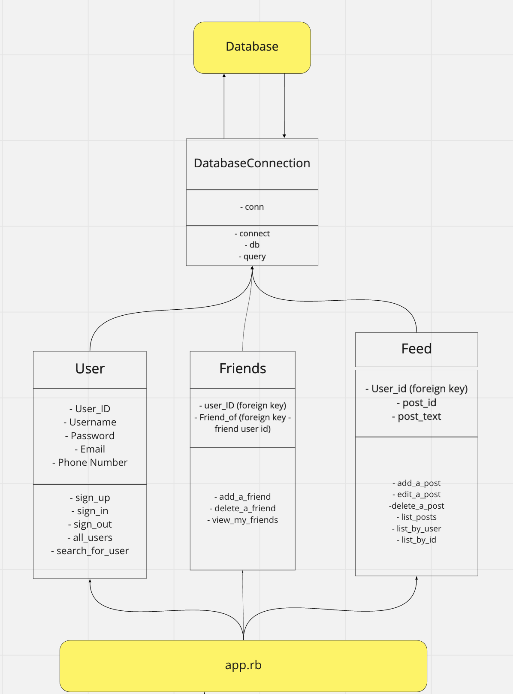

# AceBook

REQUIRED INSTRUCTIONS:

1. Fork this repository to `acebook-teamname` and customize
   the below\*\*

[You can find the engineering project outline here.](https://github.com/makersacademy/course/tree/master/engineering_projects/rails)

2. The card wall is here: <please update>

## How to contribute to this project

See [CONTRIBUTING.md](CONTRIBUTING.md)

## Quickstart

First, clone this repository. Then:

```bash
> bundle install
> bin/rails db:create
> bin/rails db:migrate

> bundle exec rspec # Run the tests to ensure it works
> bin/rails server # Start the server at localhost:3000
```

### <u>Features:</u>

- ✅ Sign-up, Login & Sign-out
- ✅ CRUD posts
- ✅ Displays posts in descending order
- ✅ Adding users
- ✅ Accept/Decline Friend Requests
- ✅ Commenting on Posts
- ✅ Profile Picture

## User Stories

```
As a user
If I’m not signed in,
I will be redirected to the sign up/login page

As an unregistered user,
So that I can use facebook,
I can sign up, using the sign up/login page

As a unregistered user,
So that I can’t enter an invalid email address,
I can see helpful information that indicates if an email is invalid

As an registered user,
So that I can use facebook,
I can log in, using the login page

As a logged in user,
So that i can stop viewing and adding posts,
I would like to sign out

As a logged in user,
So that I can see the user_posts,
I will like to access my feeds

As a logged in user,
So that I can tell people what I’m thinking,
I can make a post and see it on the page

```

## Planning

### Database:


